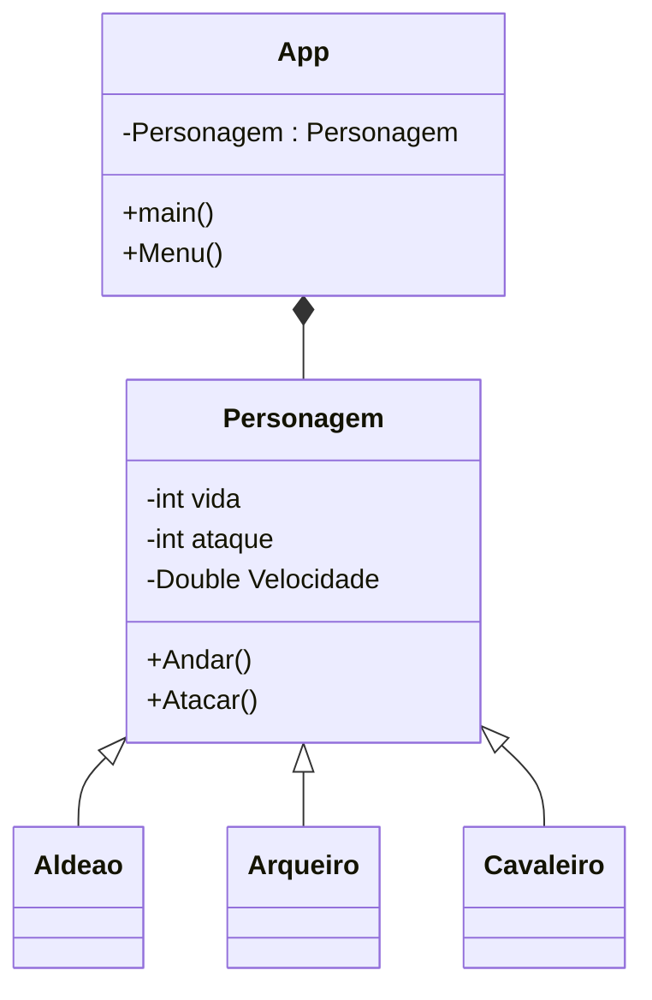

```mermaid
classDiagram
    Personagem <|-- Aldeao
    Personagem <|-- Arqueiro
    Personagem <|-- Cavaleiro
    App *-- Personagem
    class Aldeao{


    }
    class Arqueiro{


    }
    class Cavaleiro{

    }

    class Personagem{
        -int vida
        -int ataque
        -Double Velocidade
        +Andar()
        +Atacar()

    }

    class App{
        -Personagem : Personagem
        +main()
        +Menu()
    }


```