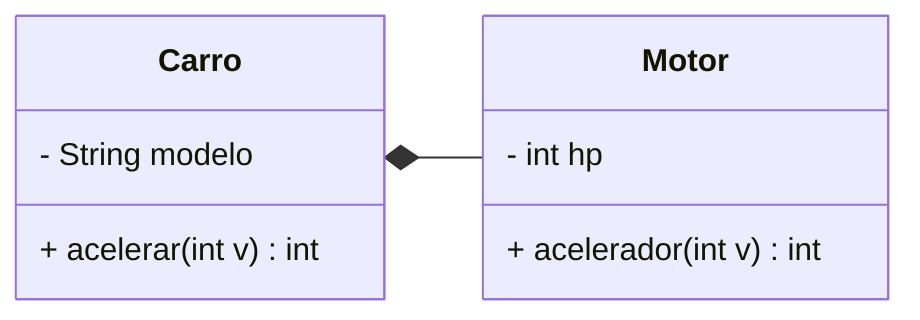

# Diagrama de classes UML

```mermaid
classDiagram

    direction LR
    
    class Carro {
    - String modelo
    + acelerar (int v) int 
    }
    
    class Motor {
        - int hp
        + acelerador (int v) int
    }
    
    Carro *-- Motor
```